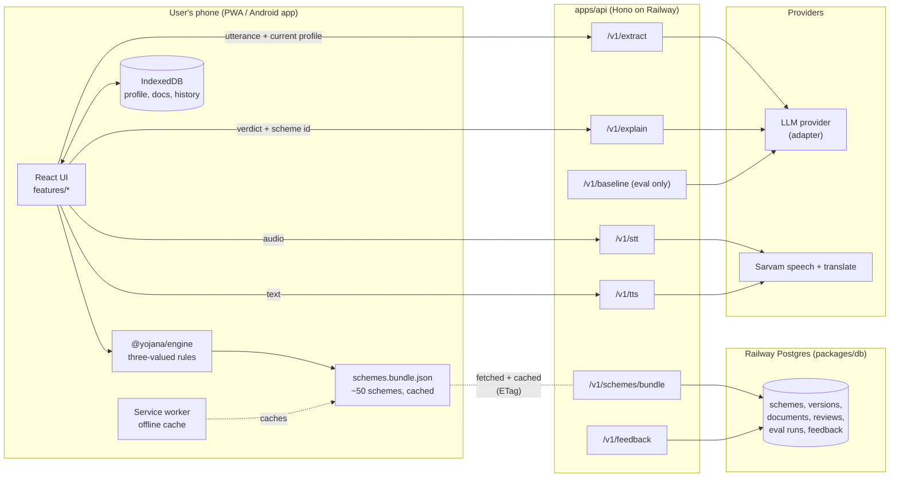
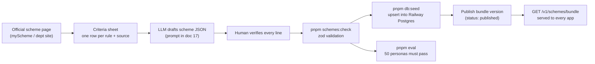

# 02 · System architecture

## The shape in one sentence

A **local-first PWA** runs the rule engine on the user's device against a cached copy of the scheme knowledge base; a **thin API on Railway** serves that knowledge base from Postgres, understands speech/text, and polishes explanations. The citizen's profile never reaches the server's database.

That one decision buys four things judges care about:

| Benefit | Why it follows |
| --- | --- |
| Works offline | Engine + schemes are bundled and cached by the service worker |
| Private | The profile lives in IndexedDB on the phone; the API never stores anything |
| Scales cheaply | Matching costs zero server compute; 1 user or 10 lakh users cost the same on the server side for matching |
| Testable | The engine is a pure function, so 50 personas run in milliseconds in CI and live on stage |

## Components

## The live request loop (one user turn)

1. User speaks or types: *"I am a widow, I work on other people's farms."*
2. (Voice only) `voice` feature records audio → `POST /v1/stt` → text.
3. `intake` sends `{utterance, lang, profile, askedField}` → `POST /v1/extract` → `{updates[]}`.
4. `profile` validates each update against the field registry (type, enum, range) and merges it with `source: "user"`.
5. `matching` calls `engine.evaluateAll(profile, schemes)` **on device** → verdicts.
6. `matching` calls `engine.nextQuestion(profile, verdicts)` → the field that settles the most "Maybe" verdicts, or `null` when done.
7. `intake` shows the question card (with tap-to-answer options) or the "See results" button.
8. On results, explanation text comes from **templates first** (offline, deterministic). If online, `POST /v1/explain` returns a friendlier version, cached by hash.

Steps 5–7 work with no network. Steps 2–3 degrade gracefully: offline, the user answers by tapping options instead of speaking.

## Offline knowledge-base pipeline (before and during the event)

**Two copies, on purpose.** The app ships with a bundled snapshot of the knowledge base (so the very first launch works offline), then checks `/v1/schemes/bundle` with an ETag and swaps in a newer published version when online. Updating a scheme means publishing a new version in the database — no app store release.

## Why this is "complex but vibe-codable"

The system has real architecture (monorepo, shared contracts, pure engine, adapters, offline sync, eval harness) but every piece is small and has one job, so an AI agent can build each piece from its SPEC.md without understanding the whole.

| Layer | Size target | Single job |
| --- | --- | --- |
| `packages/contracts` | ~300 lines | Types and zod schemas everyone shares |
| `packages/engine` | ~400 lines + tests | Profile + schemes → verdicts, next question, ranking |
| `packages/schemes` | data + ~150 lines | Load, validate, bundle scheme JSON |
| `packages/eval` | data + ~250 lines | Run personas, compute metrics, write report |
| `packages/db` | ~250 lines | Drizzle schema, migrations, seed from scheme JSON |
| `apps/api` | ~700 lines | Validate → call provider or DB → validate → return |
| `apps/web` | the rest | Screens, built feature by feature |

## Scaling path (say this to judges; don't build it)

| Stage | Change | Architecture impact |
| --- | --- | --- |
| 1 state → 36 states/UTs | Split `schemes.bundle.json` per state; download only the user's state + central | Same engine, smaller downloads |
| 50 → 4,000+ schemes | Scheduled job fetches official pages, LLM drafts rule diffs, humans approve in a review queue | Adds a `packages/kb-pipeline` and a review UI; engine unchanged |
| 3 → 22 languages | Bhashini / Sarvam translation at KB build time | i18n files grow; runtime unchanged |
| Citizens → CSC/ASHA operators | Assisted mode with local multi-profile store; optional encrypted sync | Adds an auth'd sync service, opt-in only |
| Proactive delivery | States push "you may now qualify" notices from data they already hold | New integration service; engine reused server-side unchanged |

The engine being a pure package is what makes every row above possible without a rewrite.

## Failure modes and fallbacks

| Failure | Fallback |
| --- | --- |
| No network | Tap-to-answer questions; template explanations; banner "Offline — matching still works" |
| LLM returns invalid JSON | Zod rejects it; ask the same question again with options |
| LLM extracts an out-of-range value | Rejected by field registry; ask to confirm |
| STT fails or mis-hears | Show transcript for confirmation; allow edit; fall back to typing |
| API slow (> 8 s) | Timeout; fall back as above; never block the UI |
| Stage Wi-Fi dies | Demo mode uses cached responses and bundled transcripts |
