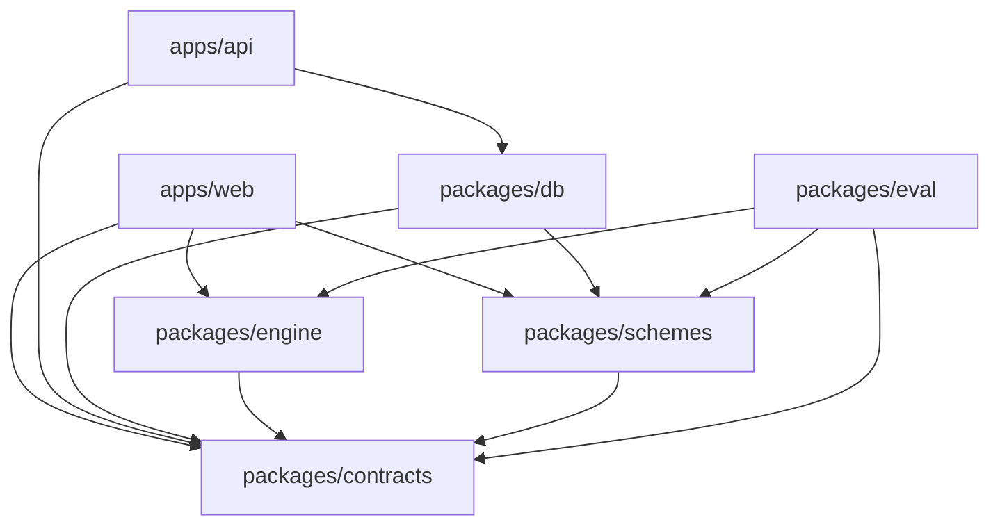

# 03 · Folder structure and import rules

The codebase is **feature-sliced**: each feature owns its UI, state, API calls, strings and tests in one folder, and exposes a small public API through `index.ts`.

## Monorepo

```
yojana-saathi/
├── package.json              # workspace scripts only
├── pnpm-workspace.yaml       # apps/*, packages/*
├── tsconfig.base.json        # strict settings + path aliases
├── apps/
│   ├── web/
│   └── api/
└── packages/
    ├── contracts/
    ├── engine/
    ├── schemes/
    ├── db/
    └── eval/
```

Package names: `@yojana/contracts`, `@yojana/engine`, `@yojana/schemes`, `@yojana/db`, `@yojana/eval`, `@yojana/web`, `@yojana/api`.

## Dependency direction (one way only)



Nothing imports from `apps/*`. `packages/engine` never imports `schemes`; schemes are passed in as data. `apps/web` never imports `packages/db` (the browser has no database access).

## apps/web/src

```
src/
├── main.tsx                  # mount, register service worker
├── app/                      # shell: router, providers, layout, error boundary
│   ├── SPEC.md
│   ├── router.tsx
│   ├── providers.tsx         # QueryClient, i18n, theme, motion config
│   ├── AppShell.tsx          # background mesh, top bar, bottom nav, offline banner
│   └── routes.ts             # route table assembled from features' routes
├── shared/                   # reusable, feature-agnostic
│   ├── SPEC.md
│   ├── ui/                   # glass design-system primitives
│   ├── api/                  # fetch client, error types, retry, timeout
│   ├── i18n/                 # i18next setup + common strings (en, kn, hi)
│   ├── storage/              # Dexie database + typed tables
│   ├── device/               # low-power detection, online status, share, haptics
│   ├── hooks/
│   └── lib/                  # tiny pure utilities (format currency, hash…)
└── features/
    └── <feature>/            # see template below
```

## Feature folder template

```
features/<feature-name>/
├── SPEC.md                   # what, why, priority, acceptance checklist
├── index.ts                  # PUBLIC API — the only file other features import
├── routes.tsx                # screens this feature owns (lazy-loaded), if any
├── components/               # PascalCase.tsx, one component per file
├── hooks/                    # use-*.ts
├── store.ts                  # Zustand slice (if the feature has state)
├── api.ts                    # calls to apps/api via @/shared/api (if any)
├── lib/                      # pure helpers local to this feature
├── i18n/
│   ├── en.json
│   ├── kn.json
│   └── hi.json
└── __tests__/
```

Not every feature needs every folder. Delete what you don't use.

### What `index.ts` may export

- Route definitions (`export const routes`)
- Hooks other features need (`useProfile`, `useVerdicts`)
- Components meant for reuse elsewhere (`<VerdictBadge />`)
- Types

Everything else stays private.

## Import rules (enforce with ESLint `no-restricted-imports`)

| From | May import | May NOT import |
| --- | --- | --- |
| `features/a/*` | `@/shared/*`, `@/features/b` (its index only), `@yojana/*` | `@/features/b/components/...`, `@/app/*` |
| `shared/*` | `@yojana/contracts`, other `shared/*` | any `features/*`, `app/*` |
| `app/*` | everything | — |
| `packages/engine` | `@yojana/contracts` | React, fetch, browser APIs |

Path aliases in `tsconfig`: `@/*` → `apps/web/src/*`.

## apps/api

```
apps/api/
├── SPEC.md
└── src/
    ├── index.ts              # Hono app, mounts routes, middleware
    ├── env.ts                # zod-validated environment variables
    ├── middleware/           # cors, rate-limit, request-id, timeout, error
    ├── routes/
    │   ├── schemes/{bundle.handler.ts, versions.handler.ts}
    │   ├── feedback/handler.ts
    │   ├── extract/{handler.ts, prompt.ts}
    │   ├── explain/{handler.ts, prompt.ts}
    │   ├── stt/handler.ts
    │   ├── tts/handler.ts
    │   ├── translate/handler.ts
    │   ├── baseline/{handler.ts, prompt.ts}
    │   └── health/handler.ts
    ├── providers/
    │   ├── llm/{types.ts, index.ts, <vendor>.ts}
    │   └── speech/{types.ts, sarvam.ts}
    └── lib/{cache.ts, hash.ts, logger.ts}
```

## packages

```
packages/contracts/src/{profile.ts, fields.ts, scheme.ts, verdict.ts, api.ts, persona.ts, index.ts}
packages/engine/src/{evaluate.ts, kleene.ts, operators.ts, next-question.ts, rank.ts, near-miss.ts, index.ts}
packages/schemes/{data/central/*.json, data/karnataka/*.json, documents.json, fields.json, src/{load.ts, validate.ts, bundle.ts}}
packages/db/{drizzle.config.ts, migrations/, src/{schema.ts, client.ts, seed.ts, publish.ts, index.ts}}
packages/eval/{personas/*.json, src/{run.ts, metrics.ts, baseline.ts}, reports/*.json}
```

## Naming

- Feature folders: `kebab-case` nouns (`scheme-detail`, not `SchemeDetailFeature`).
- Scheme ids: `central.ignwps`, `ka.<short-name>` — stable forever; never reuse an id.
- Field ids: `snake_case` (`annual_family_income`, `marital_status`).
- i18n keys: `<feature>.<screen>.<element>` (`results.header.summary`).
