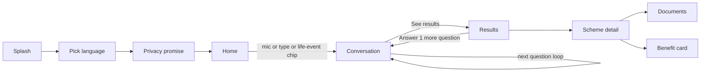

# 06 · UX flows and screens

## Main flow

First-time path to first result: **≤ 90 seconds** for the hero persona.

## Navigation

- Bottom nav (after onboarding): **Home · Results · Documents · Card**. Badge on Results shows eligible count.
- Top bar: logo (5 taps = demo mode), language switch, settings.
- Scheme detail opens as a full screen on mobile, side panel on tablet/desktop.

## Screens

Each screen lists purpose, layout, states. Microcopy is in English; all strings go through i18n.

### S1 · Splash (onboarding, P0)
Logo on animated mesh, tagline *"Find the help you're owed."* Auto-advances after 1.2 s or on tap.

### S2 · Pick language (onboarding, P0)
Three huge `LanguageTile`s showing the language in its own script: **ಕನ್ನಡ · हिन्दी · English**. Each tile plays a 1-second greeting when tapped (TTS, P1). Selection is remembered.

### S3 · Privacy promise (onboarding, P0)
One glass card: shield icon, *"Your answers stay on this phone. We never ask for Aadhaar. You can delete everything anytime."* Buttons: **Continue** (primary), *How it works* (ghost, opens sheet).

### S4 · Home (intake, P0)
- Headline: *"Tell me about yourself."*
- Centre: `MicButton` (88 px). Under it: *"or type"* text field.
- Life-event chips (horizontal scroll): *Lost my spouse · Turned 60 · Child going to college · I farm · I have a disability · Starting a business · Pregnant or new mother*. Each chip pre-fills one or more fields and starts the conversation.
- If a profile already exists: card *"Continue where you left off — 3 schemes found"*.

### S5 · Conversation (intake + matching, P0)
- Top: `ProfileMeter` ("8 of 14 facts") and a row of `Chip`s for known facts (tap to edit). Unknown fields are not shown here.
- Middle: chat thread. Saathi messages on glass-strong bubbles; user messages on accent-tinted bubbles. Transcript of voice input appears as the user bubble with an *Edit* affordance.
- Bottom: **Question card** with `QuickReply` options for the next field (e.g. *Do you have a BPL / Antyodaya ration card?* → Yes, BPL · Yes, Antyodaya · No · Not sure). Always includes **Not sure** and, for sensitive fields, **Prefer not to say**, plus a *Why we ask* link.
- Sticky: `UnlockMeter` mini + **See results (5)** button, always available.
- States: extracting (typing dots in Saathi bubble), offline (mic disabled, options still work), API error (Saathi says *"I didn't catch that — tap an answer instead"*).

### S6 · Results (results, P0)
- Header: big numbers *"3 you qualify for · 2 maybe"* and total yearly benefit where amounts are known (*"up to ₹X / year"* — only from scheme data).
- `UnlockMeter`: *"Answer 1 more question to check 2 more schemes"* → returns to S5 with that question.
- `SegmentedTabs`: **Qualify (3) · Maybe (2) · Not now (12)**.
- Cards (max 5 before "Show more"): scheme name, benefit line, `VerdictBadge`, one-line reason, level tag (Central / Karnataka).
- "Not now" cards show the failing reason and, for near misses, *"Close: you'd qualify if …"*.
- Empty state: *"No matches yet — answer 2 more questions to check 9 schemes."*

### S7 · Scheme detail (scheme-detail, P0)
Order of sections:
1. Hero: name (local language + English), benefit, `VerdictBadge`, **Read aloud** button (P1).
2. **Why** — criteria checklist: ✓ met · ✗ not met · ? unknown, each line in plain words with a tiny source link.
3. **What would change** (Maybe / Not now only) — the missing fact or the single failing criterion.
4. **Documents** — have / missing toggles (synced with Documents feature); missing ones show *How to get it*.
5. **How to apply** — numbered steps, office or portal, official apply link.
6. **Check before you go** — verify flags (`Verified` from rule, `Self-declared`, `Check with office`).
7. Footer: source URL and *"Rules last checked: <date>"*. Button: **Add to my benefit card**.

### S8 · Documents (documents, P0)
All documents needed across Qualify + Maybe schemes, deduplicated. Each row: document name, *needed for 3 schemes*, have/missing toggle, *How to get it* expander. Progress: *"You have 4 of 7 documents"*.

### S9 · Benefit card (benefit-card, P1)
Preview of a shareable card (1080 × 1350): name optional, language, list of schemes with verdicts, documents to carry, QR code linking to the scheme pages. Buttons: **Share** (Web Share / Capacitor Share → WhatsApp), **Save image**, **Read aloud**.

### S10 · Settings (settings, P0)
Language · Theme (system/light/dark) · Reduce transparency · Reduce motion · Low-power mode (auto/on/off) · Operator mode (P2) · Demo mode (hidden unless unlocked) · **Delete all my data**.

### S11 · Accuracy Lab (accuracy-lab, P1) — route `/lab`
See feature spec. Large **Run 50 personas** button, live progress, confusion matrix, metrics, engine vs baseline.

### S12 · Assisted mode (assisted-mode, P2)
Citizen list, *New citizen*, per-citizen results summary, export.

## Global states

| State | Treatment |
| --- | --- |
| Loading | `Skeleton` shimmer cards (static in low-power) |
| Offline | Thin `OfflineBanner` at top: *"Offline — matching still works. Voice needs internet."* |
| Error | Friendly sentence + **Try again**; never a stack trace |
| Update available | Toast: *"New version ready"* → **Refresh** |
| Install prompt | After first results: glass sheet *"Add Saathi to your home screen"* |

## Microcopy rules

- Grade-5 reading level. Short sentences. No acronyms without expansion on first use.
- Say **"You qualify"**, **"Maybe — needs 1 answer"**, **"Not now"** (not "Ineligible").
- Never say "guaranteed". Always *"Based on what you told us"*.
- Sensitive questions explain why: *"Some schemes are only for SC/ST families. You can skip this."*

## Google Stitch prompts (generate visual drafts, then rebuild with our components)

Use these to explore visuals fast. Do not paste Stitch code into the repo; recreate with `shared/ui` so tokens and accessibility hold.

**Home**
> Mobile app home screen for "Yojana Saathi", an AI assistant that finds Indian government welfare schemes. Glassmorphism on a dark navy background with soft indigo, teal and saffron gradient blobs. Center: a large circular microphone button with a glowing saffron-to-indigo gradient ring. Headline "Tell me about yourself". Below: a frosted text input "or type". Horizontal scroll of frosted pill chips: "Lost my spouse", "Turned 60", "Child going to college", "I farm". Bottom navigation with 4 icons: Home, Results, Documents, Card. Large readable type, rounded 24px corners, 48px touch targets.

**Conversation**
> Mobile chat screen, glassmorphism, dark navy with blurred gradient blobs. Top: slim progress bar "8 of 14 facts" and small frosted chips "Widow", "Age 58", "Farm labourer". Chat bubbles: assistant on dark frosted glass, user on saffron-tinted glass. Bottom: a frosted question card "Do you have a BPL ration card?" with large pill answers "Yes", "No", "Not sure", and a small link "Why we ask". Sticky button "See results (5)" with gradient.

**Results**
> Mobile results screen, glassmorphism. Header: big number "3 you qualify for · 2 maybe". A circular progress ring card "Answer 1 more question to check 2 more schemes". Segmented control "Qualify 3 | Maybe 2 | Not now 12". Three frosted result cards each with a scheme name, benefit line, and a status badge with icon and word: green "You qualify", amber "Maybe", grey "Not now". Clean, calm, highly readable.

**Scheme detail**
> Mobile detail screen for a government pension scheme, glassmorphism. Hero card with scheme name, monthly benefit, green "You qualify" badge, and a "Read aloud" speaker button. Section "Why" with a checklist: green ticks, red crosses, amber question marks, each with a small "source" link. Section "Documents" with toggles "I have this". Section "How to apply" with numbered steps. Section "Check before you go" with shield icons.

**Accuracy Lab**
> Desktop dashboard, glassmorphism dark theme. Title "Accuracy Lab". Big gradient button "Run 50 personas". Live progress bar. A 3x3 confusion matrix grid (expected vs predicted: Qualify, Maybe, Not now) with glowing diagonal cells. Two metric cards side by side: "Our engine — wrong 'qualify': 0" and "LLM-only — wrong 'qualify': 7". Small list of disagreements below.
