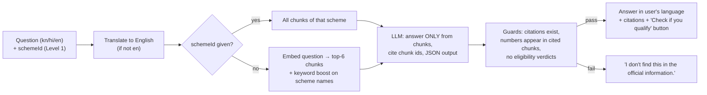

# 20 · RAG: grounded scheme Q&A

RAG answers **questions about schemes** from official text, with citations. It never answers "am I eligible?" — that stays with the rule engine (doc 08). This is the visible GenAI feature for judges who score "AI usage".

## Where RAG is used and where it is not

| Question type | Example | Who answers |
| --- | --- | --- |
| About a scheme | "How much money will I get?" "Where do I apply?" "Can I apply if I already get another pension?" | **RAG** — answer from that scheme's official text, with citations |
| Which schemes cover a need | "I need help paying for my daughter's college" | **RAG search** (Level 2) — suggests schemes, then hands over to the engine |
| Am I eligible? | "Do I qualify for PM-KISAN?" | **Engine only.** RAG replies: "Let me check with your answers" → opens the verdict |
| Anything not in the sources | "Will the amount increase next year?" | "I don't find this in the official information. Ask at your taluk office." |

## Two levels — build Level 1 first

| Level | What | Retrieval | Effort | Priority |
| --- | --- | --- | --- | --- |
| **1. Ask about this scheme** | Chat box on scheme detail | Fetch all chunks of *that* scheme by id (≈ 5–10 chunks, fits in context). No embeddings. | ~3 h (BE + FE) | P1 |
| **2. Ask anything** | Search bar on Home: free-text need → top schemes + cited answer | Embeddings over all chunks, top-k = 6, plus keyword match on scheme names | +2–3 h | P2 |

Level 1 is "retrieval by id + grounded generation". Call it what it is on stage: *"answers come only from the official text of the scheme you're looking at, with citations."* Don't call it more than it is.

## Corpus

The data track already pastes official text into the LLM to draft rules (doc 17). Save that text — it becomes the RAG corpus at no extra research cost.

```
packages/schemes/sources/<scheme-id>.md     # official text, copied from the official page(s)
                                            # first line: "Source: <url> · Retrieved: <date>"
```

Chunking (script `pnpm rag:index`, in `packages/schemes/src/rag/`):
- Split by headings, then by paragraphs; target 200–400 words per chunk, 40-word overlap.
- Each chunk: `{ id: "<scheme-id>#<n>", schemeId, heading, text, sourceUrl, lang: "en" }`.
- Level 2 only: embed each chunk with the provider's embedding model; store the vector.

Storage: Railway Postgres table `scheme_chunks` (doc 18). The API loads all chunks into memory at boot (≈ 300–500 chunks — a few MB) and refreshes when a bundle is published. **No pgvector needed**: cosine similarity over a few hundred vectors in memory takes milliseconds.

## Request flow (`POST /v1/ask`)



Request: `{ question: string ≤ 300 chars, lang, schemeId? }`. **No profile is sent.** Response: `{ answer, citations: [{ chunkId, schemeId, sourceUrl, quote }], suggestedSchemeIds: [], refused?: "not_in_sources" | "eligibility_question" }`.

## Prompt (`apps/api/src/routes/ask/prompt.ts`)

**System**
```
You answer questions about Indian government schemes for people with limited reading skills.
Use ONLY the SOURCES below. Each source has an id.
Rules:
- If the answer is not clearly in SOURCES, set "refused": "not_in_sources" and leave "answer" empty.
- If the person asks whether THEY are eligible or qualify, set "refused": "eligibility_question". Do not judge eligibility.
- Every sentence in "answer" must be supported by at least one cited source id.
- Do not add amounts, dates, documents, offices or conditions that are not in SOURCES.
- Maximum 4 short sentences. Grade-5 reading level. Answer in {{lang_name}}.
Return JSON: {"answer": string, "citations": [{"id": string, "quote": string (≤ 20 words, copied exactly)}], "refused": null | "not_in_sources" | "eligibility_question"}
```

**User**
```
SOURCES:
[{{chunk id}}] {{heading}}
{{text}}
...

QUESTION: """{{question}}"""
```

## Guards (server, after zod parse)

1. Every citation id must be one of the chunks sent. Drop unknown ids; if none remain → refuse.
2. Every `quote` must appear in its chunk (fuzzy ≥ 0.9). Drop failures; if none remain → refuse.
3. Every number (digits, ₹ amounts, dates) in `answer` must appear in a cited chunk. Otherwise → refuse.
4. If the answer contains eligibility words ("you qualify", "you are eligible", "you are not eligible" and kn/hi equivalents) → replace with the eligibility hand-off.
5. Cache by `hash(question, schemeId, lang, bundleVersion)`.

Refusals are not errors — the UI shows a friendly "not in the official information — ask at the office" with the source link.

## Evaluation (adds to the accuracy story)

Data track writes `packages/eval/rag-questions.json`: **20 questions**, each with `schemeId?`, the expected source chunk(s), and type (`answerable` / `not_in_sources` / `eligibility`).

| Metric | Definition | Target to report (honestly, whatever it is) |
| --- | --- | --- |
| Citation accuracy | answerable questions whose citations include an expected chunk | measured |
| Correct refusal | `not_in_sources` + `eligibility` questions that were refused | measured |
| Unsupported numbers | answers with a number not in cited chunks (should be 0 after guards) | measured |

`pnpm eval:rag` runs them against `/v1/ask` and writes `reports/rag-latest.json`. Add one line to the Accuracy Lab and the report (§7).

## Why this beats "just ChatGPT" (pitch line)

> "Ask it anything about a scheme — it answers only from the government's own text, shows you the exact line, and says 'I don't know' instead of guessing. And it will never tell you you're eligible; only the rule engine can."
