# Tasks — how the work is split

Three tracks run in parallel and meet at fixed **gates**. Each track owns its folders, so nobody edits the same files at 3 a.m.

| Track | File | People | Owns these folders |
| --- | --- | --- | --- |
| **Frontend** | [`frontend.md`](frontend.md) | Satvik (visual design, screens) · Samarth (app logic, mobile) | `apps/web/**` (except where a task names another owner) |
| **Backend** | [`backend.md`](backend.md) | Srujan (lead, engine, eval, integration) · Aryan (DB, API, AI routes) | `apps/api/**`, `packages/contracts`, `packages/engine`, `packages/db`, `packages/eval/src`, `packages/schemes/src` |
| **Data** | [`data.md`](data.md) | Pranav (knowledge base, report) · Shravan (personas, languages, QA, pitch) | `packages/schemes/data`, `fields.json`, `documents.json`, `packages/eval/personas`, all `i18n/*.json` reviews |
| **RAG** (cross-track) | [`rag.md`](rag.md) | DATA-09 → data · BE-16 → backend · FE-17 → frontend | `packages/schemes/sources`, `apps/api/src/routes/ask`, `features/scheme-qa` |

## Who does what

| Person | Tasks | Before the event |
| --- | --- | --- |
| **Srujan** | BE-01–04 · BE-10 (P1) · BE-11 · BE-12 · FE-12 · merges every branch, runs the gates | Railway + Sarvam accounts; one test call each |
| **Aryan** | BE-05 · BE-06 · BE-07 (**G2**) · BE-08 (**G3**) · BE-09 · BE-13 · BE-14. Start the LLM adapter and extract prompt with recorded fixtures at H2.5, once contracts land | LLM provider key + one test call; read docs 09, 13, 18 |
| **Satvik** | FE-02 · FE-04 · FE-05 · FE-08 · FE-09 (**G4**) · FE-13 (P1) · FE-14. Build FE-08/09 against mocks from H7.5; don't wait for FE-07 | Google Stitch explorations of 5 screens (doc 06) |
| **Samarth** | FE-01 (**G0**) · FE-03 · FE-06 · FE-07 · FE-10 · FE-11 (P1) · FE-15 (**G6**) | Android Studio + JDK; "hello" Capacitor APK with mic permission on the demo phone |
| **Pranav** | DATA-P1 · DATA-P2 · DATA-01 (**G1**) · DATA-02 · DATA-04 · DATA-08 (**G7**) | Scheme shortlist + criteria sheets |
| **Shravan** | DATA-P3 · DATA-P4 · DATA-03 · DATA-05 · DATA-06 · DATA-07 · demo rehearsal + backup video. Needs a native Kannada speaker on hand | 50 personas double-labelled with Pranav; hero lines by a native Kannada speaker |

If Srujan falls behind on integration, BE-10 moves to Aryan.

Srujan merges every branch into `main`. Branch names: `fe/<task-id>`, `be/<task-id>`, `data/<task-id>`.

## How the frontend never waits for the backend

1. **Contracts first.** `BE-02` publishes `@yojana/contracts` with fixtures by hour 2.5. The frontend codes against those types.
2. **Mock mode.** `FE-03` builds a mock adapter in `shared/api` that answers every route from contract fixtures (`VITE_API_MODE=mock`). The UI is built fully against mocks, then flipped to the real API at gate G3.
3. **Bundled snapshot.** The frontend reads `apps/web/public/schemes.bundle.json`. Until `BE-06` can export it from Postgres, `BE-05` generates it directly from `packages/schemes` with `pnpm schemes:bundle`.

## Gates (everyone stops and checks together, 10 minutes)

| Gate | Hour | Must be true | If it fails |
| --- | --- | --- | --- |
| **G0** | 1 | Monorepo builds; web deployed (blank shell) on a public URL; Railway project with Postgres exists | Fix before anything else |
| **G1** | 5 | Engine passes unit tests; 10 schemes validate; 10 personas pass regression; glass UI kit renders at `/dev/ui` | Cut scheme count, not tests |
| **G2** | 8 | API on Railway: health green, bundle served from Postgres; web shows onboarding + Home with real bundle | Keep frontend on bundled snapshot; continue |
| **G3** | 11 | Real `/v1/extract` in the conversation; tap-only path reaches results | Demo with tap-only + scripted extract |
| **G4** | 14 | **Hero demo end to end** (onboarding → conversation → results → detail → documents) in demo mode, offline | Everyone on P0 bugs; no P1 work |
| **G5** | 18 | 50 personas pass; baseline report committed; the 3 chosen P1 showcase features work | Drop the weakest P1 |
| **G6** | 20 | **Feature freeze.** APK installed on demo phones; backup video recorded | Only bug fixes after this |
| **G7** | 23 | Technical report PDF exported (DATA-08); deck numbers filled; both ready to submit | Submit what you have; never submit late |

## Timeline

```mermaid
gantt
  dateFormat  HH:mm
  axisFormat  %H:%M
  title 24-hour build (H0 = 00:00)
  section Backend
  Scaffold + contracts        :be1, 00:00, 2h30m
  Engine                      :be2, after be1, 3h30m
  Railway DB + API skeleton   :be3, 05:00, 3h
  Extract / explain / voice   :be4, 08:00, 5h
  Eval + baseline             :be5, 13:00, 3h30m
  Live update + hardening     :be6, 16:30, 2h30m
  Freeze support              :be7, 20:00, 4h
  section Frontend
  Scaffold + glass kit        :fe1, 00:00, 4h30m
  Shell + onboarding + kit    :fe2, after fe1, 3h
  Profile, intake, results    :fe3, 07:30, 5h
  Detail + documents          :fe4, 12:30, 2h
  Demo mode + P1 showcase     :fe5, 14:30, 4h
  Polish + APK                :fe6, 18:30, 1h30m
  Freeze                      :fe7, 20:00, 4h
  section Data
  Schemes to JSON (10)        :d1, 00:00, 5h
  Personas to JSON + labels   :d2, 00:00, 6h
  Schemes to 40+              :d3, 05:00, 9h
  Translations review         :d4, 10:00, 6h
  User tests (5 people)       :d5, 16:00, 3h
  Pitch numbers + Q&A         :d6, 19:00, 3h
```



## Task format (all three files)

```
### XX-00 · Title                       [Priority] · Hours · Depends on
Goal: one sentence.
Files: where the work lands.
Prompt: paste into your AI IDE (Antigravity / Claude Code / Cursor).
Done when: checkboxes. Tick them in the file.
```

Every prompt starts by telling the agent to read `AGENTS.md` and the relevant `SPEC.md`. Keep that line — it is what keeps the agent inside the rules.

## Before the event (allowed prep — check the rulebook)

| Who | Task |
| --- | --- |
| Data | Scheme shortlist + criteria sheets; 50 personas drafted and double-labelled; hero persona utterances written by a native Kannada speaker |
| Frontend | Google Stitch explorations of 5 screens (doc 06 prompts) — as reference images, not code; Android Studio + JDK installed; a throwaway "hello" Capacitor APK proving mic permission works on the demo phone |
| Backend | Accounts and keys: Railway, Vercel, LLM provider, Sarvam; one test call each from a scratch script (not committed to the project) |
| All | Read every doc in `docs/`. Agree on the three P1 showcase features (doc 15). |
